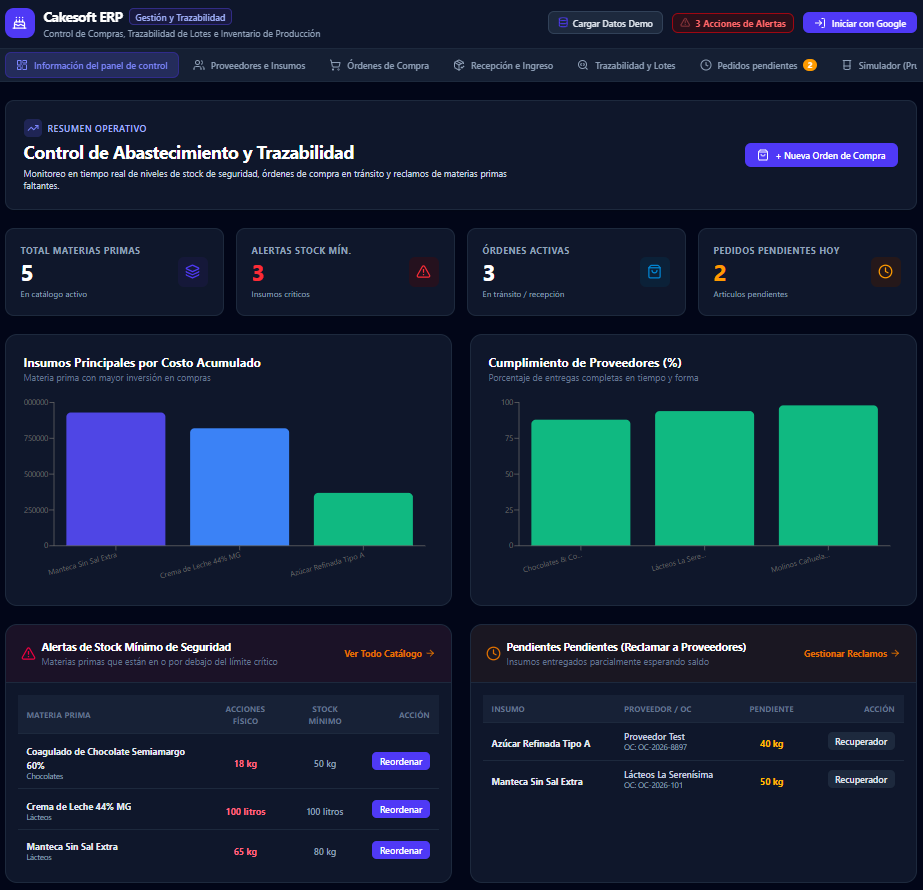
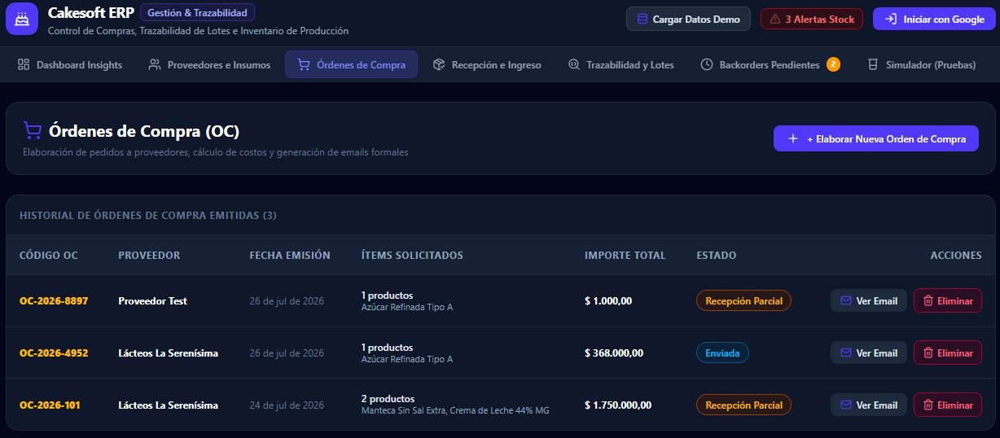
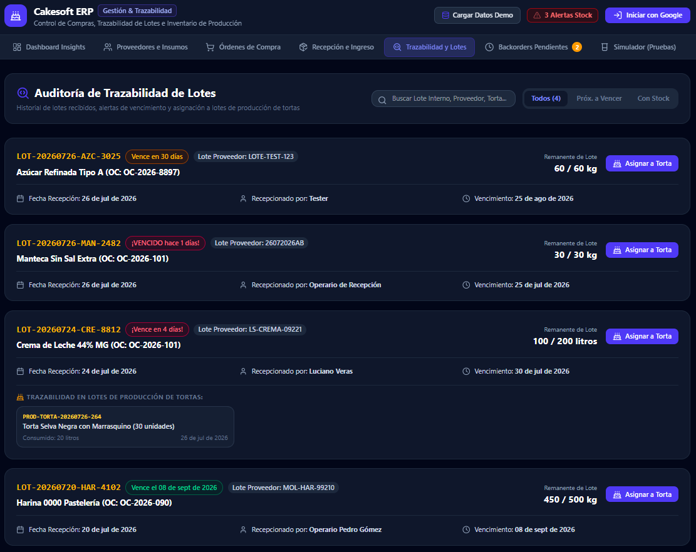

# ERP de Compras y Trazabilidad

Un sistema de planificación de recursos empresariales (ERP) moderno enfocado en la gestión de compras, inventarios y trazabilidad de materias primas. Construido con React, TypeScript y Tailwind CSS, y potenciado por Firebase para operaciones en tiempo real.

## 🚀 Características Principales

- **Dashboard Analítico:** Visión general del inventario, alertas de stock mínimo y órdenes de compra recientes.
- **Gestión de Proveedores:** Catálogo detallado de proveedores y tiempos de entrega.
- **Órdenes de Compra (OC):** Creación, seguimiento y recepción de órdenes de compra.
- **Trazabilidad y Lotes:** Autogeneración de lotes internos y seguimiento de fecha de caducidad para materias primas.
- **Backorders:** Gestión automatizada de recepciones parciales y reclamos a proveedores.
- **Panel de Simulación:** Pruebas integradas para validar flujos críticos (alertas de stock, recepciones parciales, reglas de seguridad).

## 📸 Capturas de Pantalla

> *(Reemplaza estas imágenes de marcador de posición con tus capturas de pantalla reales guardando tus capturas en la carpeta `assets`)*

### Dashboard


### Órdenes de Compra


### Trazabilidad


## 🛠️ Tecnologías Utilizadas

- **Frontend:** React 19, Vite, Tailwind CSS v4, Lucide React (Íconos)
- **Backend / Base de Datos:** Firebase (Firestore)
- **Lenguaje:** TypeScript

## 💻 Desarrollo Local

Para correr este proyecto en tu entorno local, asegúrate de tener [Node.js](https://nodejs.org/) instalado.

1. **Instalar dependencias:**
   ```bash
   npm install
   ```

2. **Configurar variables de entorno:**
   Copia el archivo `.env.example` y renómbralo a `.env.local`, luego añade tu configuración de Firebase.
   ```bash
   cp .env.example .env.local
   ```

3. **Iniciar el servidor de desarrollo:**
   ```bash
   npm run dev
   ```

4. **Acceso:**
   Abre [http://localhost:3000](http://localhost:3000) en tu navegador.
